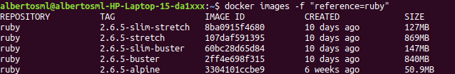
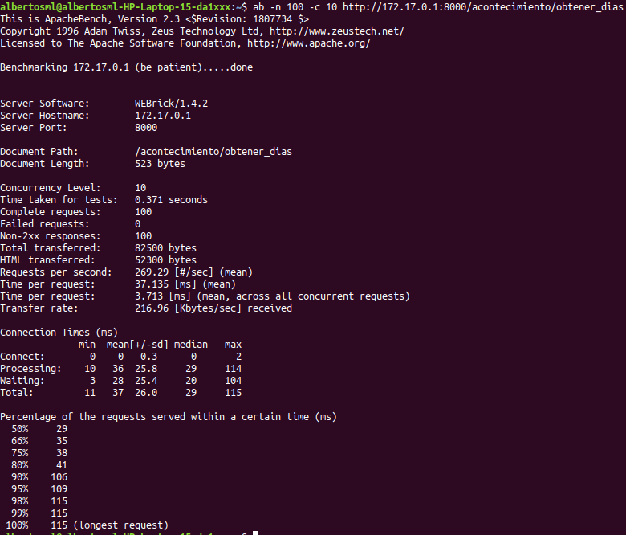
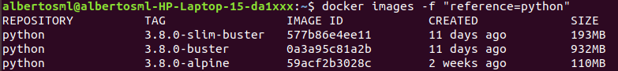
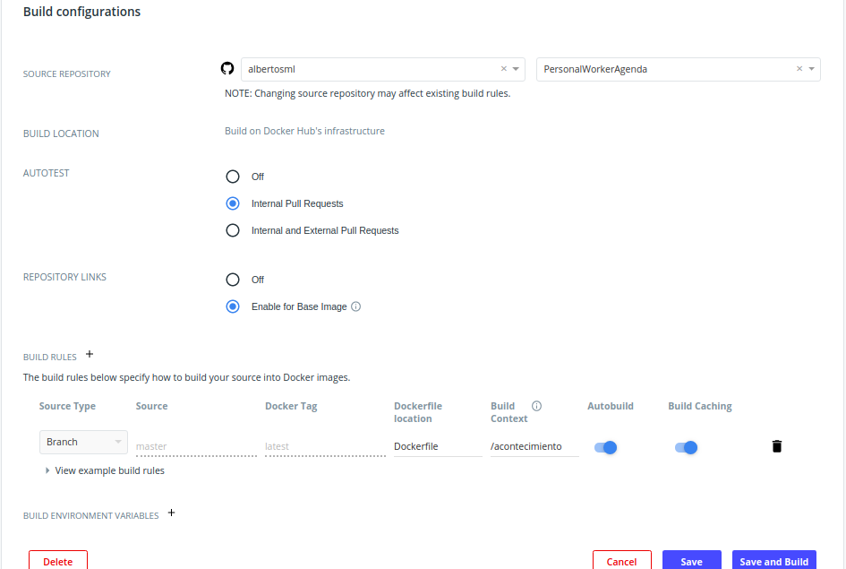

# PersonalWorkerAgenda

[](https://www.gnu.org/licenses/gpl-3.0)

[](https://travis-ci.org/albertosml/PersonalWorkerAgenda)  

[](https://circleci.com/gh/albertosml/PersonalWorkerAgenda/tree/master)

## Apartados anteriores

- [Descripción de la aplicación](docs/descripcion_aplicacion.md)
- [Licencia](docs/licencia.md)
- [Información adicional](docs/informacion_adicional.md)
- [Arquitectura y tecnologías](docs/arquitectura_tecnologias.md)
- [Integración continua y herramientas de construcción](docs/integracion_continua.md)

## Microservicios

### Acontecimiento

Para la entidad `Acontecimiento`, se ha creado una Rest API con Sinatra, en la que se ha añadido una clase, llamada
[Acontecimientos](https://github.com/albertosml/PersonalWorkerAgenda/blob/master/acontecimiento/src/acontecimientos.rb),
que contiene todos los acontecimientos que se van añadiendo al sistema, la cual actúa como capa al microservicio; también, 
se han definido las siguientes rutas asociadas a las historias de usuario:

- [/acontecimiento/nuevo](https://github.com/albertosml/PersonalWorkerAgenda/issues/6) -> Ruta que dado el título, la
hora de inicio, el creador, la descripción, la hora de fin y la hora de recuerdo (siendo los 3 últimos parámetros 
opcionales), crea un acontecimiento con los datos introducidos, pero comprobando antes que los datos estén correctos, 
una vez hecho esto, se añadiría a la capa de acontecimientos.

- [/acontecimiento/eliminar](https://github.com/albertosml/PersonalWorkerAgenda/issues/7) -> Ruta que dada la hora de
inicio y el creador, obtiene el acontecimiento asociado a esos datos y, lo cambia a estado eliminado.

- [/acontecimiento/restaurar](https://github.com/albertosml/PersonalWorkerAgenda/issues/18) -> Similar a la ruta anterior,
lo único que cambia el estado del acontecimiento a no eliminado.

- [/acontecimiento/modificar_titulo](https://github.com/albertosml/PersonalWorkerAgenda/issues/9) -> Ruta que dado el
creador, la hora de inicio y el nuevo título, obtiene el acontecimiento correspondiente y cambia el título.

- [/acontecimiento/modificar_descripcion](https://github.com/albertosml/PersonalWorkerAgenda/issues/10) -> Ruta similar
a la anterior, con la diferencia de que se cambia la descripción.

- [/acontecimiento/modificar_hora_inicio](https://github.com/albertosml/PersonalWorkerAgenda/issues/11) -> Ruta similar
a la anterior, pero modificando la hora de inicio, despúes de comprobar que se cumplen las condiciones para el cambio
de esta.

- [/acontecimiento/modificar_hora_fin](https://github.com/albertosml/PersonalWorkerAgenda/issues/12) -> Ruta similar a
la anterior, pero modificando la hora de fin.

- [/acontecimiento/modificar_hora_recuerdo](https://github.com/albertosml/PersonalWorkerAgenda/issues/13) -> Ruta similar
a la anterior, pero modificando la hora de recuerdo.

- [/acontecimiento/cancelar_recordatorio](https://github.com/albertosml/PersonalWorkerAgenda/issues/15) -> Ruta que dada
la hora de inicio y el creador, datos que identifican el acontecimiento, cancela el recordatorio, eliminando la hora de 
recuerdo.

- [/acontecimiento/devolver_agenda](https://github.com/albertosml/PersonalWorkerAgenda/issues/16) -> Ruta que dados el
creador, la fecha de inicio y la de fin, devuelve un lista de acontecimientos, mostrando en ella los datos de cada uno
de ellos.

- [/acontecimiento/repetir](https://github.com/albertosml/PersonalWorkerAgenda/issues/17) -> Ruta que dados los datos
identificativos del acontecimiento (hora de inicio y creador), la frecuencia de repetición (1=Diaria, 2=Semanal, 
3=Mensual) y la fecha de fin, crea una copia del acontecimiento obtenido, para cada repetición y, la añade a la capa
de acontecimientos.

#### Despliegue Docker

Para desplegar el microservicio en un contenedor Docker, se ha creado el archivo `Dockerfile` con el siguiente contenido:

```
# Se ha optado por una imagen base con Ruby 2.6.5
FROM ruby:2.6.5-stretch

# Establezco el creador del archivo
MAINTAINER albertosml@correo.ugr.es

# Actualizar el sistema, puesto que la imagen de Ruby se basa en la de Ubuntu 
RUN apt-get update

# Se crea un directorio base para ejecutar la aplicación
ENV DIR /home/ubuntu/app/
WORKDIR $DIR

# Habilito el puerto en una variable de entorno y lo expongo, para que puedan entrar peticiones desde ahí 
EXPOSE $PORT

# Copiar solo aquellos archivos necesarios
COPY src $DIR/src/
COPY Gemfile Rakefile config.ru $DIR

# Se instalan los paquetes necesarios para la ejecución de la aplicación
RUN gem install rake
RUN rake build

# Se crea un usuario en el sistema para ejecutar el programa
RUN useradd -r ubuntu
USER ubuntu

# Ejecuto la tarea que lanza el servidor web
CMD rake run_server[$PORT]
```

Respecto a la imagen base, se tenía que escoger entre varias opciones para la versión 2.6.5 de Ruby: buster, slim-buster,
stretch, slim-stretch y alpine. 

Primeramente, se va a descartar la imagen Alpine, por usar un compilador de C diferente a `glibc`, por lo que puede
haber problemas al instalar ciertos paquetes.

Ahora, se va a observar el tamaño de las imágenes:



Después, se va a observar el rendimiento de las 4 imágenes restantes, enviando 100 peticiones con
una concurrencia de 10 peticiones a la vez, usando AB y ejecutando el siguiente comando: 
`ab -n 100 -c 10 http://172.17.0.1:8000/acontecimiento/obtener_dias`.

Ahora, en la siguiente imagen, se va a ver un ejemplo del resultado de ejecución del comando (no se van a mostrar todas las ejecuciones por extensión del documento).



De aquí, la métrica que se va a usar para evaluar el rendimiento del servidor es el tiempo por petición, la cual es clave
para evaluar la eficiencia del microservicio. En ella, se obtienen estos resultados para las siguientes imágenes de Ruby:

1) Buster => 21,241 ms/petición

2) Slim-buster => 40,568 ms/petición

3) Stretch => 13,986 ms/petición

4) Slim-stretch => 37,135 ms/petición

Una vez analizadas estas métricas, se ha optado por la imagen `stretch`, debido a su eficiencia al atender peticiones, a pesar de la elevada diferencia de tamaño con respecto a las imágenes slim y, ser la imagen más pesada.

#### Arranque automático del microservicio

Para ello, se ha creado una tarea con la librería Rake, la cual ejecuta el microservicio usando la herramienta `rackup`,
la aplicación Rack, especificada en el archivo [config.ru](https://github.com/albertosml/PersonalWorkerAgenda/blob/master/acontecimiento/config.ru), 
en el host `0.0.0.0` y en el puerto especificado en la variable de entorno `PORT`. La tarea sería la siguiente:

```
task :run_server, [:port] do |task, args|
  sh "rackup --host 0.0.0.0 --port #{args['port']}"
end
```

### Días no laborables

Para la entidad `Dias no laborables`, se ha creado una Rest API con Flask, en la que se ha añadido una clase, llamada
[SetDiasNoLaborables](https://github.com/albertosml/PersonalWorkerAgenda/blob/master/diasnolaborables/src/setdiasnolaborables.py),
que contiene todos los conjuntos de días no laborables de cada usuario, la cual actúa como capa al microservicio; también, 
se han definido las siguientes rutas asociadas a las historias de usuario:

- [/diasnolaborables/nuevo](https://github.com/albertosml/PersonalWorkerAgenda/issues/19) -> Ruta que dado el usuario,
el conjunto de días (en forma de día de la semana y/o días concretos) y los días de antelación de recuerdo (siendo los
2 últimos parámetros opcionales), crea un conjunto de días no laborables para ese usuario con los datos introducidos,
pero comprobando antes que los datos estén correctos, sobre todo, que no exista un conjunto para ese usuario, una vez
hecho esto, se añadiría a la capa de conjuntos de días no laborables.

- [/diasnolaborables/aniadir_dias](https://github.com/albertosml/PersonalWorkerAgenda/issues/20) -> Ruta que dado el
usuario y un array con los días a añadir (días de la semana o concretos), obtiene el conjunto de ese usuario y añade
los días al conjunto, eliminando repetidos.

- [/diasnolaborables/eliminar_dia](https://github.com/albertosml/PersonalWorkerAgenda/issues/21) -> Ruta que dado el
usuario y el día de la semana o concreto a eliminar, obtiene el conjunto de ese usuario y elimina el día del conjunto, si está.

- [/diasnolaborables/obtener_dias](https://github.com/albertosml/PersonalWorkerAgenda/issues/22) -> Ruta que dados el
usuario, la fecha de inicio y la de fin, devuelve un lista con los días no laborables que tiene el usuario entre esas fechas.

- [/diasnolaborables/modificar_recordatorio](https://github.com/albertosml/PersonalWorkerAgenda/issues/24) -> Ruta que dado el
usuario y el nuevo valor de días de antelación de recuerdo, modifica este último valor.

- [/diasnolaborables/cancelar_recordatorio](https://github.com/albertosml/PersonalWorkerAgenda/issues/23) -> Ruta que dado el
usuario, cancela el recordatorio, eliminando los días de antelación de recuerdo.

#### Despliegue Docker

Para desplegar el microservicio en un contenedor Docker, se ha creado el archivo `Dockerfile` con el siguiente contenido:

```
# Se ha optado por una imagen base con Python 3.8
FROM python:3.8.0-slim-buster

# Establezco el creador del archivo
MAINTAINER albertosml@correo.ugr.es

# Actualizar el sistema, puesto que la imagen de Python se basa en la de Ubuntu 
RUN apt-get update

# Se crea un directorio base para ejecutar la aplicación
ENV DIR /home/ubuntu/app/
WORKDIR $DIR

# Habilito el puerto en una variable de entorno y lo expongo, para que puedan entrar peticiones desde ahí
EXPOSE $PORT

# Copiar solo aquellos archivos necesarios
COPY requirements.txt tasks.py $DIR
COPY src/*.py $DIR/src/

# Se instalan los paquetes necesarios para la ejecución de la aplicación
RUN pip3 install -r requirements.txt --no-cache-dir

# Se crea un usuario en el sistema para ejecutar el programa
RUN useradd -r ubuntu
USER ubuntu

# Ejecuto la tarea que lanza el servidor con gunicorn
CMD invoke run-server --port=$PORT
```

Respecto a la imagen base, se tenía que escoger entre varias opciones para la versión 3.8 de Python: buster, slim-buster
y alpine. 

Primeramente, se va a descartar la imagen Alpine, por usar un compilador de C diferente a `glibc`, por lo que puede
haber problemas al instalar ciertos paquetes.

Ahora, se va a observar el tamaño de las imágenes:



Después, se va a observar el rendimiento de las 2 imágenes restantes,enviando 100 peticiones con una concurrencia de 10
peticiones a la vez, usando AB y ejecutando el siguiente comando: 
`ab -n 100 -c 10 http://172.17.0.1:8000/diasnolaborables/obtener_dias`.

Al igual que en el otro microservicio, la métrica que se va a usar para evaluar el rendimiento del servidor es el tiempo
por petición, la cual es clave para evaluar la eficiencia del microservicio. En ella, se obtienen estos resultados para las siguientes imágenes de Python:

1) Buster => 7,827 ms/petición

2) Slim-buster => 7,962 ms/petición

Una vez analizadas estas métricas, se ha optado por escoger la imagen `slim-buster`, ya que aunque ambas tienen un 
rendimiento similar, esta última imagen, tiene un tamaño mucho menor que la imagen `buster`.

#### Arranque automático del microservicio

Para ello, se ha creado una tarea, que ejecuta, con la herramienta `invoke`, la aplicación definida en 
[app](https://github.com/albertosml/PersonalWorkerAgenda/blob/master/diasnolaborables/src/app.py), en el host `0.0.0.0`
y, en el puerto especificado en la variable de entorno `PORT`; también, se ha establecido la opción `--log-syslog`, para 
guardar los logs del servidor en el archivo syslog. La tarea sería la siguiente:

```
@task(optional=['port'])
def run_server(c, port=8000):
    c.run("gunicorn --chdir src app:app -b 0.0.0.0:{} --log-syslog".format(port))
```

## Despliegue en un PaaS

Para hacer esto, se ha optado por usar [Heroku](https://www.heroku.com/), un PaaS gratuito, fácil de usar, el cual 
proporciona una capa de seguridad, al usar el protocolo HTTPS para la transmisión de información. Este PaaS ofrece varias
opciones de despliegue, eligiendo en este caso la opción de despliegue con Docker, aprovechando la creación de un 
Dockerfile para crear contenedores, el cual se hace de la siguiente manera:

```
# Iniciar sesión en Heroku a través del cliente
heroku login

# Iniciar sesión en el registro de contenedores de Heroku (con Heroku CLI)
heroku container:login

# Iniciar sesión en el registro de contenedores de Heroku
docker login --username=<username> --password=$(heroku auth:token) registry.heroku.com

# Subo la imagen Docker generada a la aplicación
heroku container:push web -a <app>

# Despliego los cambios en la aplicación
heroku container:release web -a <app>
```

## DockerHub

Primero, lo que se ha hecho es subir cada imagen de Docker creada a DockerHub, para ello, se ha hecho lo siguiente:

```
# Iniciar sesión en DockerHub
docker login --username=<username> --password

# Etiquetar la imagen
docker tag <image> <username>/<image>:<tag>

# Subo la imagen a DockerHub
docker push <username>/<image>
```

Luego, se va a la web de [DockerHub](https://hub.docker.com/) y, allí, en la imagen correspondiente, se va a habilitar
la construcción automática de la imagen en DockerHub, cada vez que se haga un push en la rama master, poniéndole a esta
la etiqueta latest; además, se ha configurado la ruta del Dockerfile, que use la caché para hacer la imagen, que haga
tests cada vez que se hace un pull request interno y que compruebe si la imagen base se ha actualizado, si es así, 
reconstruye la imagen.



En ambos microservicios, se ha hecho lo mismo y, aquí, se presentan sus contenedores en DockerHub.

> Contenedor Acontecimiento: https://hub.docker.com/r/albertosml/acontecimiento

> Contenedor Dias No Laborables: https://hub.docker.com/r/albertosml/diasnolaborables

### Ejemplo

Se pueden probar los microservicios de la aplicación, con estas peticiones CURL:

```
# Acontecimiento
curl --header "Content-Type: application/json" --request POST --data '{"creador":"albertosml", "fechainicio": "01/03/2020", 
"fechafin": "31/03/2020"}' https://acontecimiento.herokuapp.com/acontecimiento/devolver_agenda

Respuesta: 
{ 
  "agenda": [
    {
      "titulo":"Reunión TFM",
      "descripcion":null,
      "horainicio":"04/03/2020 15:45",
      "horafin":null,
      "creador":"albertosml",
      "horarecuerdo":null,
      "eliminado":false
    }
  ]
}

# Días no laborables
curl --header "Content-Type: application/json" --request POST --data '{"usuario":"albertosml", "fechainicio": "25/01/2020", 
"fechafin": "04/03/2020"}' https://diasnolaborables.herokuapp.com/diasnolaborables/obtener_dias

Respuesta: {"diasnolaborables":["25/01/2020","01/02/2020","08/02/2020","15/02/2020","22/02/2020","29/02/2020"]}
```