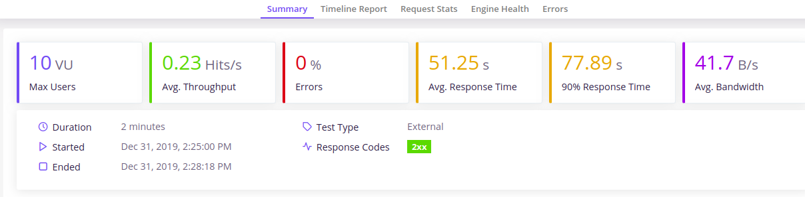
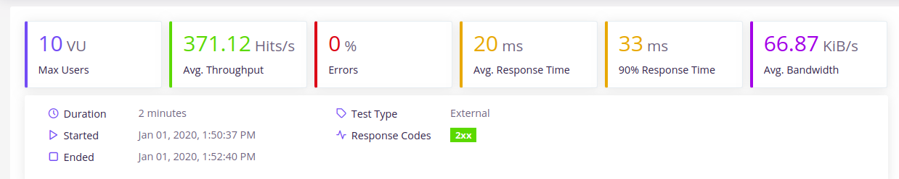
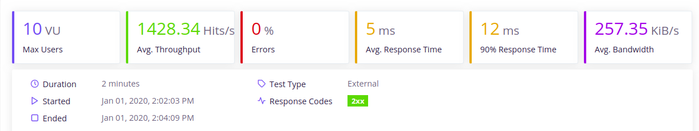
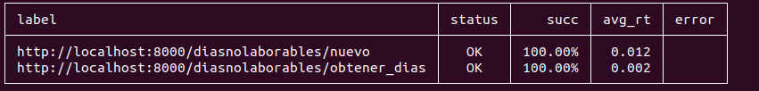

# PersonalWorkerAgenda

[](https://www.gnu.org/licenses/gpl-3.0)

[](https://travis-ci.org/albertosml/PersonalWorkerAgenda)  

[](https://circleci.com/gh/albertosml/PersonalWorkerAgenda/tree/master)

## Apartados anteriores

- [Descripción de la aplicación](docs/descripcion_aplicacion.md)
- [Licencia](docs/licencia.md)
- [Información adicional](docs/informacion_adicional.md)
- [Arquitectura y tecnologías](docs/arquitectura_tecnologias.md)
- [Integración continua y herramientas de construcción](docs/integracion_continua.md)
- [Microservicios](docs/microservicios.md)
- [Despliegue en un PaaS](docs/despliegue_paas.md)
- [Dockerhub](docs/dockerhub.md)

## Ejemplo

> buildtool: acontecimiento/Rakefile

> Contenedor: https://hub.docker.com/r/albertosml/acontecimiento

Se pueden probar los microservicios de la aplicación, con estas peticiones CURL:

```
# Acontecimiento
curl --header "Content-Type: application/json" --request POST --data '{"creador":"albertosml", "fechainicio": "01/03/2020", 
"fechafin": "31/03/2020"}' https://acontecimiento.herokuapp.com/acontecimiento/devolver_agenda

Respuesta: 
{ 
  "agenda": [
    {
      "titulo":"Reunión TFM",
      "descripcion":null,
      "horainicio":"04/03/2020 15:45",
      "horafin":null,
      "creador":"albertosml",
      "horarecuerdo":null,
      "eliminado":false
    }
  ]
}

# Días no laborables
curl --header "Content-Type: application/json" --request POST --data '{"usuario":"albertosml", "fechainicio": "25/01/2020", 
"fechafin": "04/03/2020"}' https://diasnolaborables.herokuapp.com/diasnolaborables/obtener_dias

Respuesta: {"diasnolaborables":["25/01/2020","01/02/2020","08/02/2020","15/02/2020","22/02/2020","29/02/2020"]}
```

## Almacén de datos y evaluación del rendimiento

### Almacén de datos

Para el microservicio `DiasNoLaborables`, se ha optado por usar MongoDB como almacén de datos, por ello, se ha usado la
librería [pymongo](https://api.mongodb.com/python/current/) para su interacción con el microservicio programado en
Python. Además, se ha usado la librería [mongomock](https://pypi.org/project/mongomock/), para simular una base de datos
MongoDB en memoria, la cual nos va a permitir realizar los diferentes tests.

Por último, se ha utilizado también un servicio cloud de base de datos MongoDB llamado [MongoDB Atlas](https://www.mongodb.com/cloud/atlas),
el cual se ha elegido porque es gratis, permite crear clústers en la nube para escalar la base de datos y, además,
almacenar hasta 0.5GB de datos, lo que ayudará a crear una buena base de datos de prueba. Asimismo, se ha preparado la 
clase [DiasNoLaborablesStorage](https://github.com/albertosml/PersonalWorkerAgenda/blob/master/diasnolaborables/src/diasnolaborablesstorage.py),
la cual puede conectarse tanto a bases de datos locales como remotas (cloud).

### Evaluación del rendimiento

Para realizar la evaluación del rendimiento de los microservicios, se va a usar una librería llamada [taurus](https://pypi.org/project/bzt/),
la cual permite realizar tests continuos que estime la carga que puede soportar el sistema.

Pues bien, los resultados de la evaluación son los siguientes:

#### Microservicio `DiasNoLaborables`

Partiendo del código y del contenedor Docker que se tenía en la práctica anterior y, usando la librería taurus mencionada
anteriormente, se ha realizado un informe (ejecutanto para ello el comando `bzt tests/test_rendimiento.yml -report`),
con el siguiente archivo de configuración:

> Prestaciones: diasnolaborables/tests/test_rendimiento.yml

```
execution:
- concurrency: 10  # Se simulan 10 usuarios
  ramp-up: 1m  # tiempo para alcanzar la concurrencia deseada
  hold-for: 1m # tiempo para mantener la concurrencia deseada
  scenario: obtener-dias-no-laborables

scenarios:
  obtener-dias-no-laborables:
    requests:
    - url: http://localhost:8000/diasnolaborables/obtener_dias
      method: POST
      headers:
        Content-Type: application/json
      body:
        usuario: albertosml
        fechainicio: 25/01/2020
        fechafin: 04/03/2020
    - url: http://localhost:8000/diasnolaborables/nuevo
      method: POST
      headers:
        Content-Type: application/json
      body:
        usuario: albertosml
```

En este archivo, se ha montado un escenario en el cual se envían una serie de peticiones POST, para añadir un conjunto
de días no laborables al usuario `albertosml` y, para obtener los días no laborables de este mismo usuario entre el
25/01/2020 y el 04/03/2020. 

Una vez expuesta la situación, los resultados han sido los siguientes:



En esta imagen, se puede que el rendimiento del microservicio es bajísimo (0.23 peticiones/segundo y 51 segundos de
tiempo de respuesta), pero con una fiabilidad alta (0% de errores). Esto puede ser debido a 2 causas: primero, el hecho
de tener una base de datos remota, añade una latencia adicional al tiempo de respuesta del sistema, al necesitar un
cierto tiempo para conectar con la base de datos; segundo, los contenedores docker, al tener los recursos limitados,
ralentizan el rendimiento del sistema.

Una vez dicho esto, se va a realizar otra prueba ejecutando el servidor en local (incluyendo la base de datos), obteniendo el siguiente resultado:



Aquí, se puede apreciar cierta mejora de resultados con respecto a la anterior prueba de carga (371.12 peticiones/segundo
y 20 ms de tiempo de respuesta), pero este rendimiento sigue siendo bajo, ya que no se ajusta al solicitado en esta práctica,
el cual era de 1000 peticiones/segundo para 10 usuarios concurrentes con un 0% de errores, siendo esto último lo único
que se está cumpliendo en este momento.

Llegado a este punto, hay que replantearse realizar una serie de cambios para llegar al rendimiento deseado. Para ello,
se ha realizado lo siguiente:

- Primero, se ha modificado la tarea que lanza el servidor, de forma que, va a lanzar 9 workers de gunicorn, escalando
horizontalmente el microservicio para atender más peticiones a la vez.

```
@task(optional=['port'])
def run_server(c, port=8000):
    c.run("gunicorn --workers=9 --chdir src app:app -b 0.0.0.0:{} --log-syslog".format(port))
```

- Segundo, se ha optado por añadir una memoria caché a la aplicación Flask, instalándose la librería
[Flask-Caching](https://pypi.org/project/Flask-Caching/) para ello. La caché que se ha configurado para este microservicio es una caché simple, con un timeout de 300 segundos, que ignora los errores que vayan surgiendo.

```
from flask_caching import Cache

config = {
    "CACHE_TYPE": "simple",
    "CACHE_DEFAULT_TIMEOUT": 300,
    "CACHE_IGNORE_ERRORS": True
}
app = Flask(__name__)
app.config.from_mapping(config)
cache = Cache(app)
```

También, se ha optado por cachear la única función que aporta información al usuario, la cual es la que obtiene los días no laborables de un usuario entre 2 fechas, guardando la información durante 60 segundos.

```
@app.route('/diasnolaborables/obtener_dias', methods=['POST'])
@cache.cached(timeout=60)
def obtener_dias():
    # ....
```

Una vez expuestos los cambios, estos han sido los resultados:



En los resultados, se puede observar que se ha alcanzado un rendimiento adecuado y notable ya que se han aumentado el
número de procesos que ejecutan la aplicación, por lo que se atenderán más peticiones en menos tiempo, además, la caché
ha ayudado a almacenar el resultado de la consultas anteriores, por lo que se han ahorrado llamadas a la base de datos
y, por tanto, el tiempo de respuesta por petición se ha visto reducido, esto se puede ver sobre todo, en la ruta que
obtiene los días no laborables, donde la diferencia de tiempo de petición es amplia con respecto a la otra ruta que no está cacheada.

