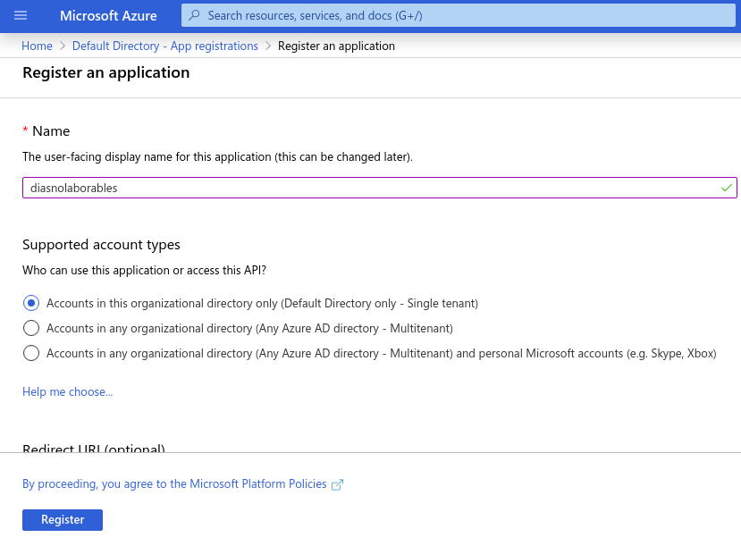
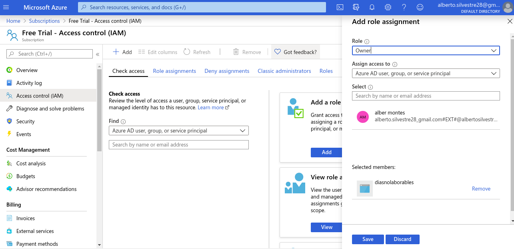
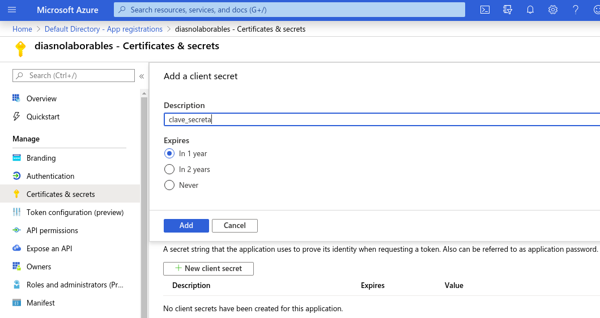
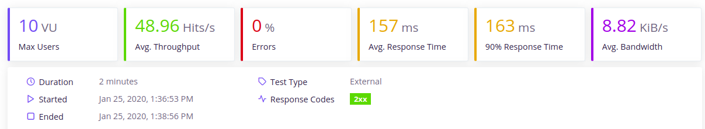
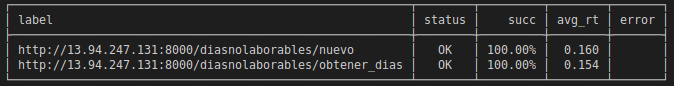

# PersonalWorkerAgenda

[](https://www.gnu.org/licenses/gpl-3.0)

[](https://travis-ci.org/albertosml/PersonalWorkerAgenda)  

[](https://circleci.com/gh/albertosml/PersonalWorkerAgenda/tree/master)

## Apartados anteriores

- [Descripción de la aplicación](docs/descripcion_aplicacion.md)
- [Licencia](docs/licencia.md)
- [Información adicional](docs/informacion_adicional.md)
- [Arquitectura y tecnologías](docs/arquitectura_tecnologias.md)
- [Integración continua y herramientas de construcción](docs/integracion_continua.md)
- [Microservicios](docs/microservicios.md)
- [Despliegue en un PaaS](docs/despliegue_paas.md)
- [Dockerhub](docs/dockerhub.md)
- [Almacén de datos y evaluación del rendimiento](docs/almacen_datos_evaluacion_rendimiento.md)

## Ejemplo

> buildtool: acontecimiento/Rakefile

> Contenedor: https://hub.docker.com/r/albertosml/acontecimiento

> Prestaciones: diasnolaborables/tests/test_rendimiento_azure.yml

Se pueden probar los microservicios de la aplicación, con estas peticiones CURL:

```
# Acontecimiento
curl --header "Content-Type: application/json" --request POST --data '{"creador":"albertosml", "fechainicio": "01/03/2020", 
"fechafin": "31/03/2020"}' https://acontecimiento.herokuapp.com/acontecimiento/devolver_agenda

Respuesta: 
{ 
  "agenda": [
    {
      "titulo":"Reunión TFM",
      "descripcion":null,
      "horainicio":"04/03/2020 15:45",
      "horafin":null,
      "creador":"albertosml",
      "horarecuerdo":null,
      "eliminado":false
    }
  ]
}

# Días no laborables
curl --header "Content-Type: application/json" --request POST --data '{"usuario":"albertosml", "fechainicio": "25/01/2020", 
"fechafin": "04/03/2020"}' http://13.94.247.131:8000/diasnolaborables/obtener_dias

Respuesta: {"diasnolaborables":["25/01/2020","01/02/2020","08/02/2020","15/02/2020","22/02/2020","29/02/2020"]}
```

## Provisionamiento

### Microservicio `DiasNoLaborables`

#### Creación de la máquina virtual

Para ello, se podía elegir entre distintos proveedores de servicios cloud como AWS, Azure o Google Cloud, pero, en esta
ocasión, se ha optado por usar este segundo, por su facilidad de uso, su precio, ya que ofrece un crédito gratuito de 
170 euros, su documentación entendible y, además, en el caso de que se acabe la subscripción, Azure cortará los servicios,
por lo que se evitará pagar un precio adicional.

Pues bien, una vez justificada la elección del proveedor cloud, lo siguiente que se va a hacer es configurar la herramienta
Ansible, que ha sido instalada en el entorno virtual de Python, con la ayuda de la siguiente 
[documentación](https://docs.ansible.com/ansible/latest/scenario_guides/guide_azure.html), en resumen, lo que se ha tenido
que hacer es lo siguiente:

- Instalar la herramienta en el entorno virtual: `pip3 install ansible[azure]`
- Crear un archivo con las credenciales de Azure y, almacenarlo en `/home/<user>/.azure/credentials`, con los siguientes datos:

```
[default]
subscription_id=<subscription-id>
client_id=<client-id>
secret=<client-secret-id>
tenant=<tenant-id>
```
Estos datos han sido obtenidos de la siguiente manera:

1- Subscription ID -> Para ello, simplemente hay que dirigirse a la subscripción y, en la pestaña de `Overview` se
obtiene el ID.
2- Tenant -> Para ello, hay que dirigirse a la pestaña del servicio `Azure Active Directory` y, ahí se encontrará
ese ID.
3- Client ID -> Para ello, en la sección del servicio mencionado en el paso anterior, se pincha en la pestaña de
`App Registration` y, se añade una nueva aplicación:



Luego, habría que dirigirse al servicio de la subscripción y, en la pestaña de `Access Control (IAM)`, crear un rol de
acceso `Owner` para la aplicación creada:



4- Secret -> Aquí, hay que dirigirse la aplicación creada, pinchamos en ella y, en la pestaña `Certificates & Secrets`,
se clica en el botón `New client secret` y, se siguen los pasos para ello:



Ya con las credenciales obtenidas, ahora con la ayuda de Ansible y el plugin de [azure_rm](https://docs.ansible.com/ansible/latest/plugins/inventory/azure_rm.html),
se ha creado una receta para crear el grupo de recursos correspondiente para este microservicio, el cual incluye una
red virtual, una subred, una IP pública (la cual es 13.94.247.131), una tarjeta de interfaz de red y, una máquina virtual,
con una potencia suficiente para procesar varias peticiones a la vez, razón por la cual se ha optado por una máquina
con 4 vCPU y 16 GB de RAM, respecto al sistema operativo, se ha optado por Debian 10, por su estabilidad, su poco peso
en memoria y su cantidad de paquetes software.

```
- name: Creación máquina virtual Azure para el microservicio `Días no laborables`
  hosts: localhost # Define el grupo de hosts
  connection: local # Define el tipo de conexión a utilizar para ejecutar las tareas que se exponen a continuación 
  tasks: # Presenta el conjunto de tareas a hacer para crear la máquina virtual
  - name: Crear grupo de recursos
    azure_rm_resourcegroup: # Uso del plugin azure_rm para la creación de un grupo de recursos en Azure a través de Ansible
      name: grupo_recursos # Define el nombre del grupo de recursos
      location: westeurope # Establezco la zona oeste de Europa como localización del grupo de recursos
  - name: Crear red virtual
    azure_rm_virtualnetwork: # Uso del plugin azure_rm para la creación de una red virtual en Azure a través de Ansible
      resource_group: grupo_recursos # Indico el grupo de recursos a la que pertenece esta red virtual
      name: red_virtual # Define el nombre de la red virtual
      address_prefixes: "10.0.0.0/28" # Se reservan 8 IPs, ya que se van a usar pocas direcciones
  - name: Crear subred asociada a la red virtual
    azure_rm_subnet: # Uso del plugin azure_rm para la creación de una subred en Azure a través de Ansible
      resource_group: grupo_recursos # Define el grupo de recursos al que pertenece
      virtual_network: red_virtual # Define la red virtual a la que pertenece
      name: subred # Nombre de la subred
      address_prefix: "10.0.0.8/29" # Se han reservado 2 IPs: 1 IP máquina virtual + 1 IP máquina base de datos MongoDB (más las 5 reservadas por Azure)
  - name: Crear IP pública
    azure_rm_publicipaddress: # Uso del plugin azure_rm para la creación de una IP pública en Azure a través de Ansible
      resource_group: grupo_recursos # Define el grupo de recursos al que pertenece
      allocation_method: static # Indica que el método de asignación de la IP pública sea estática (fija)
      name: ip_publica
    register: ip_pulica_diasnolaborables # Registro la IP obtenida en una variable para mostrarla por consola
  - name: Mostrar por consola la IP pública obtenida
    debug:
      msg: "La IP pública para la máquina de diasnolaborables es: {{ ip_pulica_diasnolaborables.state.ip_address }}." # En modo de depuración, se muestra un mensaje con la IP obtenida
  - name: Crear un grupo de seguridad que permita una conexión SSH, HTTP y al puerto de la aplicación
    azure_rm_securitygroup: # Uso del plugin azure_rm para la creación de un grupo de seguridad de red en Azure a través de Ansible
      resource_group: grupo_recursos # Define el grupo de recursos al que pertenece
      name: grupo_seguridad # Define el nombre del grupo de seguridad de red
      rules: # Define las reglas de entrada/salida del grupo de seguridad
        - name: SSH # Nombre de la regla de SSH
          protocol: Tcp # Protocolo
          destination_port_range: 22 # Puerto al que afecta
          access: Allow # Se permite acceso
          priority: 101 # Prioridad de la regla
          direction: Inbound # Regla de entrada
        - name: HTTP # Nombre de la regla de HTTP
          protocol: Tcp # Protocolo
          destination_port_range: 80 # Puerto al que afecta
          access: Allow # Se permite acceso
          priority: 102 # Prioridad de la regla
          direction: Inbound # Regla de entrada
        - name: Flask # Nombre de la regla del puerto de la aplicación
          protocol: Tcp # Protocolo
          destination_port_range: 8000 # Puerto al que afecta
          access: Allow # Se permite acceso
          priority: 103 # Prioridad de la regla
          direction: Inbound # Regla de entrada
  - name: Crear la tarjeta para la interfaz de red virtual
    azure_rm_networkinterface: # Uso del plugin azure_rm para la creación de la tarjeta de interfaz de red virtual en Azure a través de Ansible
      resource_group: grupo_recursos # Define el grupo de recursos al que pertenece
      virtual_network: red_virtual # Define la red virtual a la que pertenece
      subnet: subred # Define la red a la que pertenece
      public_ip_name: ip_publica # Define a la IP pública asociada
      security_group: grupo_seguridad # Define el grupo de seguridad al que pertenece
      name: interfaz_red # Nombre de la interfaz de red
  - name: Crear la máquina virtual para la ejecución del microservicio
    azure_rm_virtualmachine: # Uso del plugin azure_rm para la creación de la máquina virtual en Azure a través de Ansible
      resource_group: grupo_recursos # Define el grupo de recursos al que pertenece
      network_interfaces: interfaz_red # Define la interfaz de red a la que pertenece
      name: maquinavirtual # Nombre de la máquina virtual
      vm_size: Standard_B4ms # Se elige el tamaño de la máquina virtual: aquí se ha optado por una máquina con potencia (4 vCPU y 16 GB de RAM)
      admin_username: diasnolaborables # Se ha elegido el nombre del microservicio como nombre de usuario del administrador
      ssh_password_enabled: false # Solo se va a permitir la autenticación a la máquina virtual a través de la clave pública, no con contraseña
      ssh_public_keys:
        - path: /home/diasnolaborables/.ssh/authorized_keys # Ruta donde se va a almacenar la clave pública
          key_data: <public-key> # Clave pública
      image:
        offer: debian-10 # Sistema operativo
        publisher: Debian # Distribuidor
        sku: 10 # Número de instancia del distribuidor
        version: latest # Versión de Ubuntu
```
Una vez ya se tiene la receta, lo siguiente sería preparar la configuración de ansible, para ello, se han preparado los
siguientes archivos:

- `ansible.cfg`: Contiene la configuración de ansible. Su contenido es:

```
[defaults]
host_key_checking = False  # Acepta las claves de las nuevas máquinas
inventory = ./ansible_hosts # Ruta del fichero donde se van a indicar que máquinas se controlan
```

- `ansible_hosts`: En este archivo, se van a poner las direcciones de cada host y de cada grupo; en este caso, el archivo quedaría de esta manera:

```
[localhost]
13.94.247.131
```

Ya, por último, solo quedaría ejecutar la receta con el comando `ansible-playbook provisionamiento/creacion_maquina_virtual.yml`.

#### Instalación de los paquetes necesarios para la máquina

Para esta parte, se ha decidido usar un rol de Ansible Galaxy para instalar MongoDB, en este caso, se ha optado por el
siguiente [rol](https://galaxy.ansible.com/undergreen/mongodb), el cual se ha instalado con el comando `ansible-galaxy install undergreen.mongodb` y, 
que se ha incluido en la receta de instalación del resto de paquetes, quedando de la siguiente manera la receta:

```
- hosts: localhost # Grupo de máquinas
  become: yes # Necesita adquirir privilegios para ejecutar el resto del fichero
  roles: # Uso el rol undergreen.mongodb de Ansible Galaxy para instalar MongoDB
    - { role: undergreen.mongodb }
  tasks:
    - name: Comprobar si Python 3 está instalado
      shell:
        cmd: which python3 # Comando que comprueba si Python 3 está instalado (produce salida si está instalando indicando dónde)
      register: python_disponible # Se registra en una variable la salida del comando
      ignore_errors: yes # Ignora que este comando no tenga salida, ya que nos interesa para saber que Python3 no está instalado en el sistema
    - name: Instalar python 3
      apt: pkg=python3 state=present # Se instala el paquete apt de python 3
      when: python_disponible.rc != 0 # Se comprueba con la variable obtenida anteriormente si se ha obtenido salida
    - name: Comprobar si pip 3 está instalado
      shell:
        cmd: which pip3 # Comando que comprueba si pip3 está instalado (produce salida si está instalando indicando dónde)
      register: pip3_disponible  # Se registra en una variable la salida del comando
      ignore_errors: yes # Ignora que este comando no tenga salida, ya que nos interesa para saber que Python3 no está instalado en el sistema
    - name: Instalar pip 3
      apt: pkg=python3-pip state=present # Se instala el paquete apt de pip3
      when: pip3_disponible.rc != 0  # Se comprueba con la variable obtenida anteriormente si se ha obtenido salida
    - name: Comprobar si git está instalado
      shell:
        cmd: which git # Comando que comprueba si git está instalado (produce salida si está instalando indicando dónde)
      register: git_disponible # Se registra en una variable la salida del comando
      ignore_errors: yes # Ignora que este comando no tenga salida, ya que nos interesa para saber que Python3 no está instalado en el sistema
    - name: Instalar git
      apt: pkg=git state=present # Se instala el paquete apt de git
      when: git_disponible.rc != 0  # Se comprueba con la variable obtenida anteriormente si se ha obtenido salida o no
    - name: Crear directorio con el código del microservicio
      file: # Con el módulo de file se crea el directorio que va a contener el código del microservicio
        path: PersonalWorkerAgenda
        state: directory
    - name: Descarga del código de la aplicación de Github
      git: # Se usa el módulo de git para descargar la versión master del repositorio y lo clonamos en el directorio creado para ello
        repo: https://github.com/albertosml/PersonalWorkerAgenda.git
        version: master
        dest: PersonalWorkerAgenda
    - name: Instalar el entorno virtual de Python
      pip: # Con el módulo de pip, se va a instalar virtualenv con pip3
        name: virtualenv
        executable: pip3
    - name: Comprobar que el servicio de mongod se activa al iniciar la máquina
      shell: # Con el módulo shell, se va a comprobar que mongo se va a activar siempre que se inicie la máquina
        cmd: grep 'sudo service mongod start' ~/.bashrc
      register: mongo_activado # Se registra en una variable la salida del comando
    - name: Indicar en el archivo .bashrc que el entorno se iniciar cada vez que se encienda la máquina
      shell: # Aquí, se va a insertar la línea que inicia mongo en el archivo .bashrc
        cmd: echo 'sudo service mongod start' | sudo tee -a ~/.bashrc
      when: mongo_activado != 0 # Condición que comprueba si la línea de mongo se ha insertado en el archivo (lo hace con la variable de antes), si es así, se ejecuta el comando
    - name: Instalar el paquete invoke en el entorno virtualenv
      pip: # Se instala el paquete invoke con pip
        name: invoke
    - name: Ejecutar la tarea que instala los paquetes requeridos en el entorno
      shell: # En el directorio del microservicio, se va a ejecutar con invoke la tarea que instala los requerimientos de la aplicación
        cmd: invoke build
        chdir: PersonalWorkerAgenda/diasnolaborables
    - name: Ejecutar la aplicación
      shell: # Ejecutamos la aplicación en el directorio del microservicio (ES OPCIONAL, SOLO SE HACE SI QUEREMOS ARRANCAR LA APLICACIÓN DIRECTAMENTE )
        cmd: invoke run-server --port=8000 --daemon=True
        chdir: PersonalWorkerAgenda/diasnolaborables
```

En esta ocasión, la receta se ha ejecutado de la misma manera que antes, pero especificando el usuario de la máquina:
`ansible-playbook receta.yml -u diasnolaborables`

#### Test de carga del microservicio

Una vez se tiene la máquina virtual con la aplicación arrancada, lo siguiente que se procede a hacer es realizar el test
de carga, para ello, se va a usar el archivo de carga de la práctica anterior y la herramienta taurus, cambiando
solamente el host.

Los resultados que se han obtenido son los siguientes:





En los resultados, se puede ver que aunque la máquina tenga buenas prestaciones, los resultados son malos por la latencia de la red, lo que provoca que solo hayan 48 peticiones por segundo.