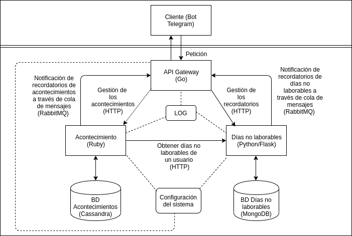

# Arquitectura y Tecnologías

### Arquitectura

La arquitectura que se va a usar para esta aplicación es una basada en microservicios, en la cual cada entidad del 
problema será un microservicio, desplegando así de forma independiente la lógica de cada uno de los elementos 
principales del problema. 

Ahora, se va a exponer un diagrama que representa la arquitectura de la aplicación:

En él, se puede observar que va a haber un cliente, que en este caso, es un bot de Telegram, pero podría ser una web o 
una aplicación (aunque, en ese caso, se tendría que añadir un microservicio para la gestión de usuarios, ya que en esta
aplicación se pasa la autentación de los usuarios a Telegram); pues bien, este cliente, se va a comunicar con nuestro 
servidor a través de una API Gateway, a la cual le enviará peticiones. 

Esta API Gateway, se encargará de recibir las peticiones de cada cliente y pasárselas al microservicio más adecuado para
su procesamiento. Luego, cada microservicio monta una REST API, encargada de gestionar las peticiones para esa entidad 
y, una base de datos, en la que se almacena la información sobre la entidad de cada microservicio.

También, se dispondrá de un sistema de logs centralizado para almacenar el historial de peticiones del sistema, así 
como de un sistema de almacenamiento de la configuración crítica de la aplicación (direcciones y puertos de los 
microservicios, API keys, etc..), el cual va a estar centralizado. Tanto el API gateway como los microservicios, van a 
estar conectados a estos dos sistemas, de los cuales se acaban de hablar.

Respecto a la comunicación entre microservicios, la entidad `Acontecimiento` se comunicará con la entidad `Vacaciones`
para obtener la información de los días no laborables de un usuario.

Por último, se va a montar dos brokers de mensajería mediante el patrón `publish/subscribe` para las notificaciones de 
los recordatorios tanto de los días no laborables como de los acontecimientos, donde se publica un mensaje con el 
contenido de la notificación, a la cola de mensajes del API gateway; luego, este API gateway consume el mensaje y envía 
la notificación correspondiente a esa persona. 

### Tecnologías

Ahora, se van a presentar las tecnologías (y bibliotecas), que van a usar los diferentes elementos de la aplicación:

- API Gateway -> Para este elemento, se ha optado por usar el lenguaje [Go](https://golang.org/), el cual es compilado y 
permite controlar de forma eficiente, sencilla y automática la concurrencia, pudiendo así procesar más rápidamente las 
peticiones de los clientes al sistema, al poder atender más peticiones a la vez de forma eficiente. En concreto, se va a 
usar el framework [KrakenD](https://github.com/devopsfaith/krakend), el cual permite montar una API Gateway que sea 
sencilla de configurar (para conectar los microservicios), concurrente y de alto rendimiento, también, este framework 
permite mantener un sistema de logs con el historial de peticiones del sistema.

- Entidad `Acontecimiento` -> Para este microservicio, se va a optar por usar el lenguaje de programación 
[Ruby](https://www.ruby-lang.org/en/), que es un lenguaje interpretado; en concreto, se va a usar el lenguaje específico 
para crear aplicaciones web, llamado [Sinatra](https://github.com/sinatra/sinatra), el cual permite montar una REST API 
de manera muy sencilla, gestionando todo tipo de peticiones HTTP. La base de datos que va a usar este microservicio es 
[Apache Cassandra](http://cassandra.apache.org/), la cual es una base de datos no relacional orientada a columnas, 
eligiéndose debido a su escalibilidad, su tolerancia a fallos, su eficiente sistema de indexación y, garantizando además
que toda columna de un registro tiene su correspondiente valor, siendo este nuestro caso para esta entidad; pues bien,
para que esta base de datos se comunique con nuestro microservicio en Ruby, se va a usar la librería 
[cassandra-driver](https://github.com/datastax/ruby-driver). También, se va almacenar aquí la configuración crítica del 
sistema, usando un almacén clave-valor distribuido como es [etcd](https://github.com/etcd-io/etcd), el cual se puede 
usar en Ruby de manera sencilla, a través de la librería [etcdv3](https://github.com/davissp14/etcdv3-ruby). Por último,
para almacenar los logs de este microservicio, se va a usar la librería [logger](https://github.com/ruby/logger) y, 
montará un broker de mensajería con RabbitMQ, el cual usa el protocolo AMQP para las comunicaciones, apoyándose en la 
librería [bunny](https://github.com/ruby-amqp/bunny).

- Entidad `DiasNoLaborables` -> Para este microservicio, se ha optado por usar el framework 
[Flask](http://flask.palletsprojects.com/en/1.1.x/), basado en un lenguaje de programación interpretado y, muy usado en 
la actualidad, como es [Python](https://www.python.org/). Este microservicio va a tener asociada una base de datos no 
relacional orientada a documentos, como es [MongoDB](https://www.mongodb.com/), elegida para esta entidad debido a su 
escabilidad, eficiencia y, sobre todo, por su flexibilidad en la estructura de datos, ya que va a haber diferentes 
formas de establecer un conjunto de días no laborables (mediante el día de la semana o un conjunto de días); la 
aplicación web se va a comunicar con la base de datos a través de la librería 
[pymongo](https://api.mongodb.com/python/current/). Para los logs del microservicio, se va a utilizar la librería 
[logging](https://docs.python.org/2/library/logging.html), la cual viene asociada ya de serie al lenguaje. Por último, 
para las notificaciones de los usuarios a las personas correspondientes, se montará un broker de mensajería con RabbitMQ, 
usando para ello la librería [pika](https://pika.readthedocs.io/en/stable/).
