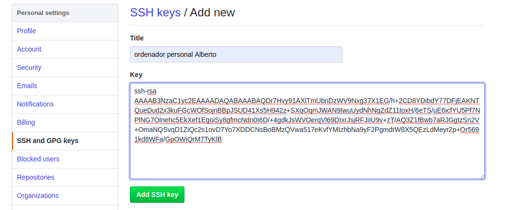
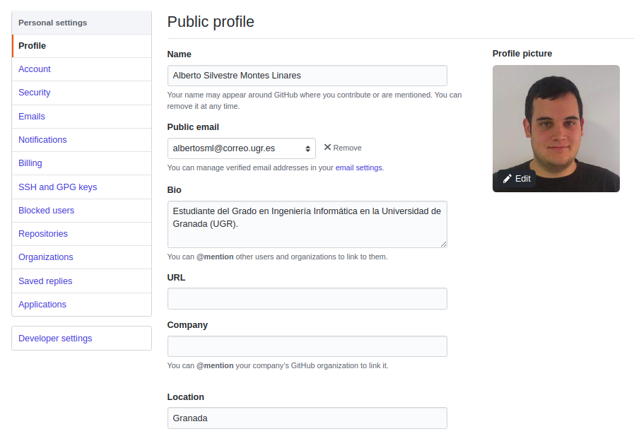
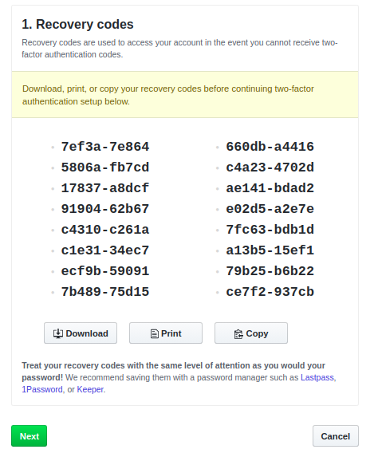

# Configuración del entorno

Para lograr este objetivo, se ha realizado lo siguiente:

- Descarga de git para usarlo desde línea de órdenes -> Para ello, se ha ejecutado el comando `sudo apt-get install git`.
- Creación de par de claves y subida de clave pública a GitHub -> Los pasos realizados para lograr esto son:
    + Ejecutar el comando `ssh-keygen`, indicando el archivo de salvado de la clave (por defecto, es el archivo `~/.ssh/id_rsa.pub`) y un passphrase, que es opcional.
    + Obtener la clave pública, con el comando `cat ~/.ssh/id_rsa.pub`.
    + Dirigirse a GitHub, al apartado de `Settings > SSH and GPG keys > New SSH key` y asociar nuestra clave pública obtenida con nuestra cuenta de Github. Ya hecho esto, veríamos la clave asociada.
    
- Configuración correcta del nombre y correo electrónico para que aparezca en los commits -> Para ello, ejecutamos los siguientes comandos para configurar, en mi caso:
    + Correo: `git config --global user.email "albertosml@correo.ugr.es"`
    + Nombre: `git config --global user.name "Alberto Silvestre Montes Linares"`
- Edición del perfil de GitHub para que aparezca una imagen en vez del avatar por omisión, nombre completo y ciudad, así como universidad -> Básicamente, para hacer esto, hay que dirigirse a `Settings > Profile` y adjuntar los diferentes datos que se solicitan. 

- Incrementar la seguridad de nuestra cuenta en GitHub activando el segundo factor de autenticación -> Para ello, dirigirse a `Settings > Security > Two-factor authentication > Enable two-factor authentication`, una vez ahí indicar la vía de autenticación (en mi caso, he escogido la autenticación por app mediante "Google Authenticator") y obtener las claves de recuperación. 

   

   Finalmente, se escanearía el código con la aplicación y se introduciría. 
    
    